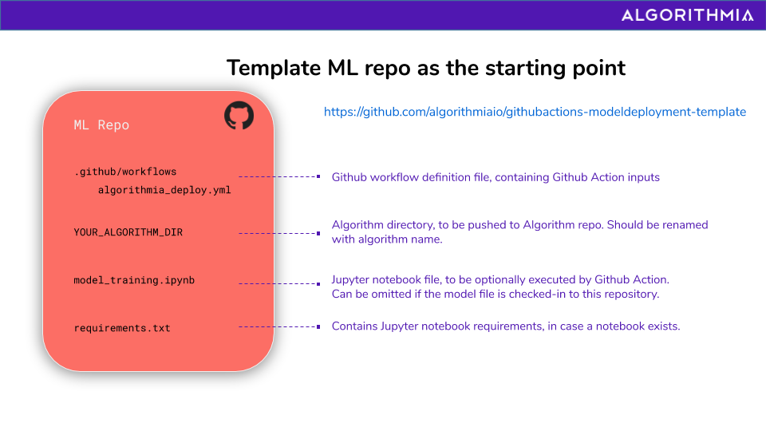
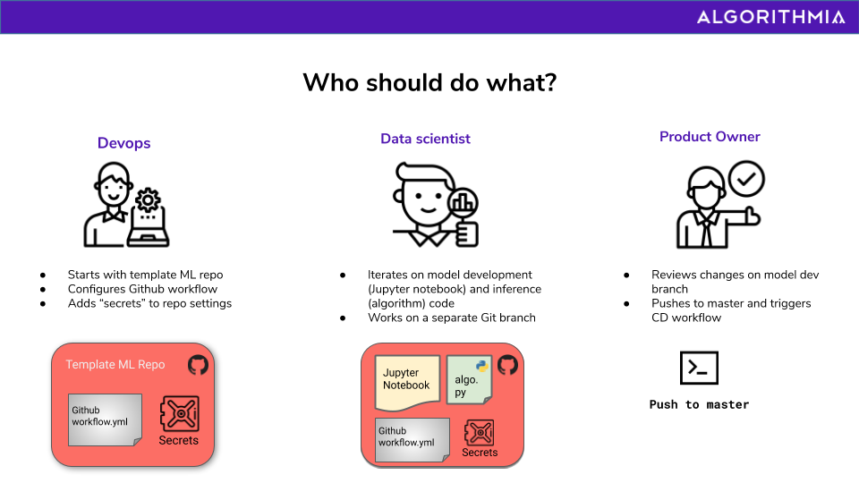

# Template ML Repository for Continuous Deployment to Algorithmia via Github Actions

This is a template ML repository to get started with [Algorithmia Model Deployment Github Action](https://github.com/algorithmiaio/algorithmia-modeldeployment-action) integration, containing some necessary pieces of the integration as a starter kit. 

Algorithmia's Continuous Deployment Github Action would be a good fit for your workflow if you are using a Jupyter notebook to train and evaluate your ML model or checking your saved model file into your repository and you have your inference (algorithm) script & dependencies in your ML repo. 

After you create an algorithm on Algorithmia as the scalable inference endpoint for your ML model, you can make use of this template repository to make the configurations in your ML repository at Github. You can either take this as a starting point and use the green `Use this Template` button above to create your own repository off of this, or clone this repo and copy the desired files to over to your existing ML repository. 

## Template Repo Contents

## Fitting With Organizational Responsibilities
Thinking about fitting this automation into mature organizations' workflows, and how it will play out for teams with separate concerns and responsibilities, the template repository can act as a starter kit for the DevOps or the IT teams. After configuring this starter repository with necessary inputs, they can hand it off to the data science team so that they can start working on it and continuously deploy their artifacts to Algorithmia, as they iterate.

## Example usages
Check out the two example ML repos that take this template repository as a starter and integrate the Algorithmia Github Action to continuously deploy
  * [to an Algorithmia algorithm backed by Algorithmia](https://github.com/algorithmiaio/githubactions-modeldeployment-demo-algorithmiaalgo)
  * [to an Algorithmia algorithm backed by Github](https://github.com/algorithmiaio/githubactions-modeldeployment-demo-githubalgo)

